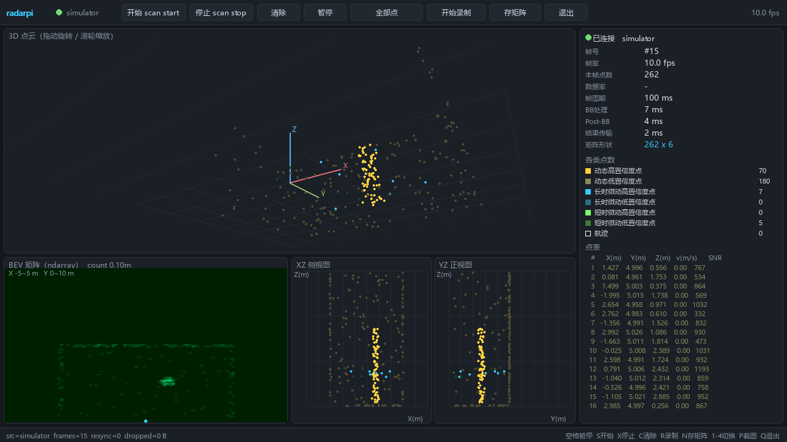

# radarpi —— 4D 成像毫米波雷达的树莓派上位机

把原厂只提供 Windows 版的上位机（`CalterahRadarAppMgmtTool`）搬到 **Raspberry Pi 4B /
Raspberry Pi OS** 上运行。纯 Python 实现，**核心只依赖标准库**（`pyserial` 可选），
离线可装、装完即用。

提供两种界面 + 一套算法接口：

| | 命令 | 适用场合 | 额外依赖 |
| --- | --- | --- | --- |
| **Web 版** | `radarpi serve` | 手机/电脑浏览器远程查看、长期无人值守 | 无 |
| **pygame 版** | `radarpi view` | 树莓派接显示器或 VNC、要低延迟、要实时看算法结果 | `python3-pygame` `python3-numpy` |
| **矩阵接口** | `radarpi.ndarray_iface` | 聚类/跟踪/建图/神经网络等二次开发 | `python3-numpy` |

```
┌──────────────┐  USB 转串口   ┌────────────────────────────┐  局域网/HDMI  ┌──────────┐
│ 4D 成像雷达   │ ────────────► │ 树莓派 4B (radarpi)        │ ────────────► │ 浏览器    │
│ 3000000 8N1  │  TX↔RX 交叉   │ 串口链路 · 协议解析 · 录制  │               │ 或本机窗口│
└──────────────┘               │ Web 服务 · pygame · ndarray │               └──────────┘
                               └────────────────────────────┘
```

---

## 目录结构

```
radarpi/
├── src/radarpi/            上位机源码（Python 包）
│   ├── protocol.py         串口协议：包解析 / 组包 / 配置指令
│   ├── serialport.py       串口访问层（pyserial 或标准库 termios 双后端）
│   ├── link.py             真机链路（自动重连）与仿真数据源
│   ├── ndarray_iface.py    ★ 点云 → numpy 矩阵接口（BEV/体素/处理器链）
│   ├── viewer_pygame.py    ★ pygame 桌面版上位机
│   ├── recorder.py         CSV / JSONL / npz 录制与回放
│   ├── webapp.py           内置 HTTP + SSE 服务（Web 上位机后端）
│   ├── static/             前端：3D 点云、三个投影视图、点表、设置面板
│   ├── doctor.py           环境体检（串口驱动/权限/抢占/波特率）
│   ├── config.py           配置文件读写
│   └── cli.py              命令行入口
├── examples/processor_demo.py  ★ 算法处理器样板（可直接抄）
├── packaging/              安装包
│   ├── build_deb.py        生成 .deb（跨平台，只要有 Python 3）
│   ├── install.sh          源码安装（不依赖 dpkg）
│   ├── install-ch343-driver.sh  可选：CH343 厂商驱动安装助手
│   ├── postinst/prerm/postrm    Debian 维护脚本
│   ├── radarpi-web.service  systemd 服务
│   ├── radarpi-viewer.desktop   桌面菜单里的 pygame 入口
│   ├── 99-radarpi.rules     udev 规则（权限、屏蔽 ModemManager/brltty 抢占）
│   └── radarpi.conf         默认配置
├── tests/                  自检（无需 pytest）
├── docs/使用说明.md / .pdf  使用手册
└── dist/                   build_deb.py 的输出
```

---

## 安装

### 方式一：.deb 安装包（推荐）

```bash
# 把 dist 目录里的包拷到树莓派（U 盘 / scp 都可以）
sudo apt update
sudo apt install ./radarpi_1.0.0_all.deb      # 注意前面的 ./

# 可选：pygame 桌面版 + 矩阵接口需要的依赖（Web 版不需要）
sudo apt install -y python3-pygame python3-numpy fonts-noto-cjk
```

安装脚本会自动：建专用系统用户 `radarpi`、把安装者加入 `dialout` 组、
装 udev 规则、停用会抢占串口的 brltty 规则、启动并开机自启 `radarpi-web` 服务。

卸载：`sudo apt remove radarpi`（保留数据）/ `sudo apt purge radarpi`（连数据一起删）。

### 方式二：源码安装

```bash
# 在源码目录里执行
sudo ./packaging/install.sh                  # 完整安装 + 启动服务
sudo ./packaging/install.sh --no-service     # 只装程序
sudo ./packaging/install.sh --uninstall      # 卸载
```

### 方式三：不安装，直接跑（调试用）

```bash
git clone <本目录> 或直接拷贝源码
cd radarpi
PYTHONPATH=src python3 -m radarpi serve        # 需要 python3，无需其它依赖
```

---

## 快速开始

```bash
radarpi doctor            # 第一步：体检。串口、权限、驱动、波特率一次看全
radarpi doctor --probe    # 真机联调：打开串口读 3 秒，看能否解出帧
radarpi ports             # 列出串口设备，自动标出"疑似雷达"
radarpi serve             # 启动 Web 上位机（默认 0.0.0.0:8080）
radarpi view              # 启动 pygame 桌面上位机（本机屏幕 / VNC）
```

浏览器打开 `http://<树莓派IP>:8080/` 就能看到 3D 点云。
没有雷达也能先熟悉界面：

```bash
radarpi serve --simulate          # 内置仿真场景（房间墙面 + 走动的人）
radarpi view --simulate           # pygame 版同一套仿真
radarpi replay out.csv --loop     # 回放历史录制
```

常用命令：

| 命令 | 作用 |
| --- | --- |
| `radarpi doctor [--probe]` | 环境体检 / 真机联调 |
| `radarpi ports` | 列串口设备及其芯片、驱动 |
| `radarpi serve [--simulate\|--replay F]` | 启动 Web 上位机 |
| `radarpi view [--processor M:F] [--bev-mode M]` | 启动 pygame 上位机 |
| `radarpi monitor` | 终端查看实时帧率与各类点数 |
| `radarpi record out.csv [-f jsonl]` | 录制点云 |
| `radarpi replay out.csv [--loop]` | 回放录制 |
| `radarpi send "scan start"` | 直接下发一条指令 |
| `radarpi send --key boundary 3 3 1 1 5` | 按指令名下发 |
| `radarpi apply` | 把配置文件里的参数一次性下发 |
| `radarpi config set radar.boundary "-3 3 0.8 0.2 5"` | 改配置 |
| `radarpi sniff --hex` | 原始抓包，核对协议/排查固件差异 |

---

## pygame 桌面版（`radarpi view`）

```bash
sudo apt install -y python3-pygame python3-numpy fonts-noto-cjk   # 中文字体可选
radarpi view                       # 接真机
radarpi view --simulate            # 无雷达
radarpi view --fullscreen --bev-mode max_abs_v
radarpi view --processor ./examples/processor_demo.py:process
```

界面：3D 点云（拖动旋转/滚轮缩放）+ **BEV 矩阵热图** + XZ/YZ 投影 + 实时统计 +
点表。



*（上图为 `radarpi view --simulate` 的实拍；挂上算法处理器后右上角会显示处理器名
与耗时、右侧"矩阵形状"会变成处理后的点数 —— 见 `docs/pygame_console_processor.png`。）*快捷键：`空格` 暂停、`S/X` 收发开关、`C` 清除、`R` 录制、`N` 存矩阵、
`1-4` 切换显示、`P` 截图、`F` 全屏、`Q` 退出。

两个特别有用的参数：

* `--snapshot out.png --snapshot-frames 90`：画够 90 帧后截图退出 —— **没有显示器
  也能自检**，也便于用 cron 定时抓图留证；
* `--processor 模块:函数`：挂载算法处理器，界面实时显示处理后的点云（见下）。

> Web 版与 pygame 版**不能同时运行**（串口独占）：`sudo systemctl stop radarpi-web`
> 让出串口后再跑 `radarpi view`。

---

## ndarray 矩阵接口（算法接入）

`radarpi.ndarray_iface` 把每帧点云统一成 `(N, 6)` float32 矩阵，列顺序固定为
`x, y, z, snr, v, group`（用 `nd.POINT_FIELDS` 取，不要按位置猜）。

```python
from radarpi.link import RadarLink
from radarpi import ndarray_iface as nd

for points, frame in nd.stream_arrays(RadarLink(device="auto")):     # points: (N, 6)
    target = nd.filter_points(points, groups=nd.GROUP_DYNAMIC,       # 只留动态点
                              x_range=(-3, 3), y_range=(1, 8), z_range=(0.25, 2.2))
    bev = nd.to_bev(target, resolution=0.05, mode="count")           # (H, W) 俯视矩阵
    vox = nd.to_voxel(target, resolution=0.2)                        # (NX, NY, NZ) 体素
    chans = nd.to_bev_channels(target, resolution=0.1, channels="groups")  # (6, H, W)
```

| 函数 | 输出 | 用途 |
| --- | --- | --- |
| `frame_to_ndarray(frame)` | `(N, 6)` float32 | 点云矩阵，最常用 |
| `tracks_to_ndarray(frame)` | `(M, 6)` | 航迹（末列是航迹号） |
| `frame_to_bundle(frame)` | dict | 打包存档（`np.savez` 直接用） |
| `filter_points(...)` | `(N, 6)` | 按类别/范围/SNR/速度过滤 |
| `to_bev(points, mode=...)` | `(H, W)` | 俯视栅格：`count`/`max_snr`/`max_abs_v`/`mean_v`/`min_dist` |
| `to_bev_channels(points)` | `(6,H,W)` 或 `(3,H,W)` | 多通道，直接喂 CNN |
| `to_voxel(points)` | `(NX, NY, NZ)` | 3D 体素 |
| `bev_extent()` / `bev_to_world()` | — | 矩阵行列 ↔ 世界坐标换算 |
| `stream_arrays(source)` | 生成器 | 真机/仿真/回放统一入口 |
| `ArrayPipeline` | — | 处理器链 |

BEV 坐标约定：**行 = Y（前向，行 0 最近），列 = X（横向，`W//2` 为 X=0）**。

**把算法挂到界面上**（`fn(points, frame) -> ndarray | None`，返回矩阵就替换显示，
返回 `None` 只做观测）：

```bash
radarpi view --processor ./examples/processor_demo.py:process
```

完整说明见 `docs/使用说明.md` 第七章（pygame）与第十五章（矩阵接口）。

---

## 与原 Windows 上位机的功能对照

| 原上位机（Windows） | radarpi（树莓派） | 说明 |
| --- | --- | --- |
| Com Set：选 COM 口 + 3000000 波特率 | 自动识别串口，`radarpi ports` 可查 | 支持 `/dev/ttyUSB*`、`/dev/ttyACM*`、`/dev/ttyCH343USB*`、`/dev/radar` |
| Radar Set：高度 / 倾斜 / Boundary / 门限 | `set radar_height` / `set radar_inclination` / `set boundary` / `set_cfar_coeff` / `set_mmsinterval` | 网页"设置 → 雷达指令"点"下发"，或 `radarpi send`，或 `radarpi apply` |
| Start / Stop | 网页/pygame 的"开始 / 停止"，或 `scan start` / `scan stop` | 连接后自动 `scan start`（可关） |
| 3D 点云 + 三个投影视图 + 点表 | Web 版一致；pygame 版另有 BEV 矩阵热图 | 彩色区分 6 类点，含速度与 SNR |
| Data Path / 数据保存 | `radarpi record`、界面"开始录制" | CSV（一行一点）/ JSONL（一行一帧），另可存 `.npz` 矩阵 |
| Playback 回放 | `radarpi replay`、`--replay` | 支持循环与倍速 |
| （无）算法二次开发接口 | **ndarray 矩阵接口 + `--processor` 插件** | 本移植版新增能力 |
| Upgrade 固件升级 | **不支持** | 固件升级仍需 Windows 上位机，见下文限制 |
| 校准向导 Calibration | **不支持** | 保留 Windows 上位机做校准 |

---

## 协议要点

串口 **3000000 / 8 / N / 1**（手册第四节）。数据流由三种包组成，均以固定包头开始：

| 包 | 包头 | 包尾 | 长度 |
| --- | --- | --- | --- |
| 帧头包 | `0xFFEEFFDC` | `0xFFEEFFD3` | 固定 28 字节 |
| 点云包 | `0xFFDDFECB` | `0xFFDDFEC4` | `4 + 10×点数 + 8` |
| 航迹包 | `0xFFCCFDBA` | 手册未给出 | `4 + 航迹字段×航迹数` |

帧头包携带 6 类点数（动态高/低置信度、长时微动高/低置信度、短时微动高/低置信度）、
航迹数、帧号、帧周期与三段耗时。每个点 10 字节：X/Y/Z（int16，0.001 m）、
SNR（uint16 线性值）、速度（int16，0.1 m/s）。

实现上有两处**主动容错**，因为手册表格存在信息缺口：

1. **字节序自动判定**：首次命中包头时判断大端/小端，避免猜错导致完全无数据。
2. **航迹字段数自适应**：手册在「航迹 End X」处截断，无法确认航迹是否含 SNR/速度。
   解析器按 6 字节与 10 字节两种布局试探，用"包后是否紧接合法包头"判定并记住结果。

上真机后建议先跑 `radarpi sniff --hex` 核对包头与字段，若有出入改 `protocol.py`
顶部的常量即可（解析器会记录 `resyncs` / `bad_tails` 等统计，便于判断）。

---

## 已知限制

* **固件升级**（原上位机 Upgrade 菜单）与**校准向导**未移植：这两项依赖厂商私有的
  升级/校准协议，手册未公开，误操作可能变砖。请保留一台 Windows 电脑做这两件事。
* **航迹包字段**按上文自适应处理，首次接真机请用 `radarpi sniff` 确认一次。
* **CH343/CH344 串口小板**：Linux 主线内核没有 `ch343` 驱动（`ch341.c` 只覆盖
  CH340/CH341）。多数 CH343 模块本身兼容 CDC-ACM，会被 `cdc_acm` 枚举为
  `/dev/ttyACM0`，可直接用；若插上后 `/dev` 下什么都没有，用
  `packaging/install-ch343-driver.sh` 装 WCH 厂商驱动，或换 **FT232** 小板
  （内核自带 `ftdi_sio`，支持到 3000000，插上即用，最省事）。
* **CH340/CH341 小板不能用**：最高只有 2 Mbit/s，达不到 3000000。
* Web 界面**没有鉴权**，只应部署在受信任的局域网内。

---

## 自检 / 二次开发

```bash
cd radarpi
PYTHONPATH=src python tests/test_protocol.py   # 协议解析与指令（18 项）
PYTHONPATH=src python tests/test_link.py       # 串口链路、录制回放、仿真（10 项）
PYTHONPATH=src python tests/test_ndarray.py    # 矩阵接口：BEV/体素/过滤/插件（16 项）
SDL_VIDEODRIVER=dummy PYTHONPATH=src python tests/test_viewer.py   # pygame 界面（8 项）
python packaging/build_deb.py --verify         # 重新打包并自检 .deb 结构
```

`tests/test_link.py` 用假串口把真实链路跑通（含断线重连），`tests/test_viewer.py`
用 SDL 的 dummy 驱动离屏渲染，所以**不接硬件、不接显示器也能验证**绝大部分逻辑。
